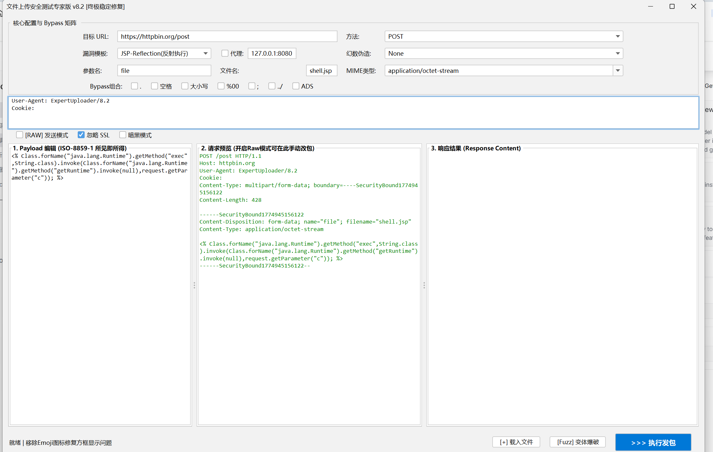

# 文件上传安全测试工具

    

一款专注于解决「孤立上传 API 测试痛点」的渗透测试工具，让无前端页面的上传接口测试更高效、更精准。

## 一、开发背景：为何诞生此工具？

在日常渗透测试、红蓝对抗及 SRC 漏洞挖掘中，文件上传场景主要分为两类，其中**隐性上传场景**的核心痛点，成为工具开发的核心契机：

### 1.1 两种上传场景对比

| 场景类型       | 特点描述                                                                                                                                                                      | 操作难度                                                                                                                                                                                                 |
| ---------- | ------------------------------------------------------------------------------------------------------------------------------------------------------------------------- | ---------------------------------------------------------------------------------------------------------------------------------------------------------------------------------------------------- |
| 显式上传（理想场景） | 有前端页面，可直接点击上传按钮                                                                                                                                                           | 低：配置 BurpSuite 代理后，可快速抓取 multipart/form-data 数据包，后续通过 Repeater 重放、改包、绕过即可                                                                                                                            |
| 隐性上传（痛点场景） | 仅暴露后端接口地址（无前端页面），常见于前后端分离架构（Vue/React）、微服务项目，通过目录扫描、JS 解析、Swagger 文档泄露或 API 路由泄露发现（典型地址：`http://target.com/api/v1/user/avatar/upload`、`http://ip:port/api/common/upload`） | 高：面临三大核心问题：1. 无法抓包：无前端上传按钮，BurpSuite 无法获取初始数据包，无现成请求模板； 构造繁琐：multipart/form-data 协议结构复杂，需手动控制 boundary 分隔符、CRLF 换行符、计算 Content-Length，微小失误（如多打空格）即返回 400/500 错误； 效率低下：测试后缀绕过等策略时，需反复手动维护数据包结构，测试效率极低 |

## 二、工具定位

文件上传接口的「全自动狙击镜」，核心解决「孤立上传 API 难以快速构造有效请求」的痛点，实现 **「跳过前端，直接对话后端 API」** 的测试模式。

## 三、核心优势与功能

### 3.1 核心优势

* 🚀 **无需前端页面依赖**：仅需提供上传接口 URL，瞬间生成符合 RFC 标准的上传报文，彻底摆脱对前端页面的依赖；

* 🛠️ **全自动化构造**：自动完成 Boundary 分隔符生成、Content-Type 声明、Content-Length 计算，100% 规避手动构造的语法失误；

* ⚔️ **贴合实战需求**：内置渗透测试实战常用策略，无需额外配置即可开展测试。

### 3.2 核心功能

1. 后缀绕过组合拳：集成点绕过、空格绕过、大小写混淆等常用绕过逻辑；

2. 幻数伪造：自动为测试文件添加对应格式幻数，提升绕过成功率；

3. 免杀混淆模板：内置 PHP、JSP 等主流脚本语言的免杀混淆模板，适配实战场景；

4. 一键生成请求包：输入 URL 后，自动生成可直接用于 BurpSuite 等工具的测试包。

## 四、核心价值总结

| 测试模式 | 核心逻辑                        | 效率对比          |
| ---- | --------------------------- | ------------- |
| 传统模式 | 先有上传页面 → 抓取数据包 → 手动修改测试     | 低效率，依赖前端，易出错  |
| 工具模式 | 先有接口 URL → 一键生成专业绕过包 → 直接测试 | 高效率，跳过前端，精准绕过 |

该工具将测试人员从繁琐的数据包手工构造工作中解放，聚焦漏洞挖掘与绕过策略验证，大幅提升红蓝对抗、SRC 漏洞挖掘中的实战效率与精准度。

